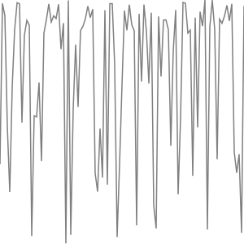
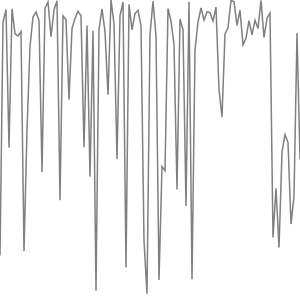

# seeded-random-number-generator

This vanilla JS-Class is inteded to be used like `Math.random()` but provides controll over the used seed.

Just like `Math.random()` this class should **NOT** be used for cryptographically secure random numbers. The _seed_ can be used to rectreate any operations executed.

> Note: Math.random() does not provide cryptographically secure random numbers. Do not use them for anything related to security. Use the Web Crypto API instead, and more precisely the window.crypto.getRandomValues() method. **[https://developer.mozilla.org/](https://developer.mozilla.org/en-US/docs/Web/JavaScript/Reference/Global_Objects/Math/random)**

## Usage

To generate numbers you have to instanciate the _SeededRandom_ class first. At this point you have to choose the seed the calculations are based on. Any positive Integer (between 1 and 999999999999999) works. The value of the seed does not effect the returned values other than providing a set starting point. **Negative seeds might not work properly. You can not (effectivly) change the used seed after first generation of a value.**

Afterwards every time you call the `getIntervalValue()` method you will get a new value. You can control the range of values possible by providing a _list_ containing the minimum and maximum value possible following this format `[min, max]`. By default the interval is set to the unit interval ([0, 1]) like you would expect using `Math.random()`.

## Example - Plotting Values
This requires a \<body> tag in the html as well as a \<script src="/path/to/class"></script> reference.

```JS
const sr = new SeededRandom(4292374); // instanciation
let valueArray = []; // will contain the calculated values to display

/* generate values */
for (i = 0; i <= 100; i++) {
    valueArray.push(sr.getIntervalValue([0, 100]));
}

/* create and append svg canvas */
const svg = document.createElementNS("http://www.w3.org/2000/svg", 'svg');
svg.setAttribute("viewBox", `0 0 100 100`);
svg.style.width = 300;
svg.style.height = 300;

document.body.appendChild(svg);

/* create and append path using the values */
const path = document.createElementNS("http://www.w3.org/2000/svg", 'path');
pathValues = ""

// bind values to SVG commands
for (i in valueArray){
    if (i == 0){
        pathValues += `M${i} ${valueArray[i]}`; // Move cursor to the first coordinates
    }
    else{
        pathValues += `L${i} ${valueArray[i]}`; // LineTo x->i, y->valueArray[i]
    }
}

path.setAttribute("d", pathValues);
path.style.fill = "none";
path.style.stroke = "black";
path.style.strokeWidth = "0.5";
svg.append(path);
```

The results look like this:

*Seed: 42*
<p></p>

*Seed: 1*
<p></p>

*Seed: 9123445*
<p></p>
